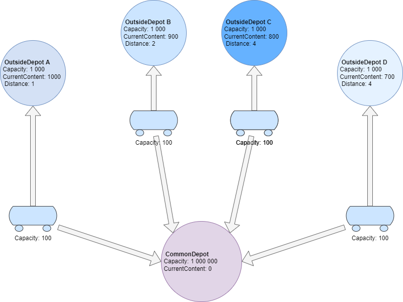
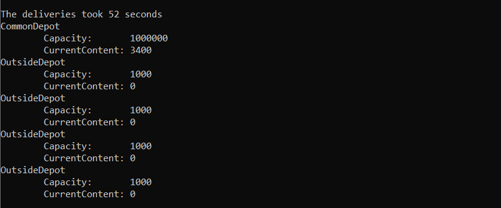

Lernzielkontrolle:
==================

**Überprüfung der Lerninhalte:** 
- Die Programmierkonzepte **async** und **await** anwenden können.
- Die Anwendung von Task.WhenAny(...) anwenden können.
- Die Anwendung von Task.WhenAll(...) anwenden können.

## Sammeln von Weizen in ein Depot von Aussenlager
### Grundsystem

**WheateDepot** Dieses System simuliert das Einsammeln von Weizen aus den Aussenlagern. In den Aussenlagern ist der Weizen zwischengelagert und soll mittels LKW's in die Sammelzentrale (WheatDepot) transportiert werden. Die LKW's fahren zu den Aussenlagern, werden mit Weizen befüllt und liefern diesen Weizen in das Zentrallager. Dieser Vorgang wird so lange wiederholt, bis die Aussenlager leer sind. Folgende Ressourcen sind verfügbar:

- Ein WheatDepot zum Einsammeln der Lieferungen 
  - (es können gleichzeitig 10 LKW's abgepumpt werden)
- Es stehen max. 4 LKW's für das Einsammeln zur Verfügung
  - (ein LKW kann die Kapazität von 100 m3 fassen)
- Es gibt 4 Aussenlager an unterschiedliche Orten 
  - (die Aussenlager haben entsprechende Lagermengen in m3 - CurrentContent)

In der nachfolgenden Abbildung ist das System skizziert:

Beschreibung der Eigenschaften:

|Name|Beschreibung|
|----|------------|
|Capacity|max. Menge in m3|
|CurrentCapacity|aktuelle Menge in m3|
|Distance|Entfernung in Sekunden|
|IsFull|Der LKW ist befüllt|
|FillUp*|Der LKW wird gerade befüllt|
|Delivery|Der LKW ist gerade am Ausliefern|

* Das Befüllen eines LKW's benötigt 0,5 Sekunden

Die Projektstruktur von *WheatDepot* besteht aus einzelne Projekte und ist zu einer Solution zusammengefasst. Die Struktur besteht aus den Projekten:

|Name|Beschreibung|
|---|---|
|WheatDepot.Common|In diesem Projekt sind die gemeinsamen Klassen wie DeliveryTruck, Depot, WheatDepot, OutsideDepot implementiert.|
|WheatDepot.Logic|In diesem Projekt befinden sich die Klasse DeliveryService für das asynchrone Einsammeln von Weizen aus den Aussenlagern.|
|WheatDepot.ConApp|Eine Konsolen-Anwendung zum Starten für die Simulation mit Zeitangabe.|

## Ausgabe
Die Musterlösung liefert folgende Ausgabe:

 

**Ausarbeitung der Aufgabe**  

- Ergänzen Sie die fehlenden Implementierungen (**NotImplementationException()**)
- Simulieren Sie ein optimiertes Einsammeln entsprechend der Ressourcen (**asynchron**)

## Hilfsmitteln
-   keine

## Abgabe
-   Termin: 50 min. nach der Vorbereitung

-   Klasse:

-   Name:

## Quellen
-  keine

# 
